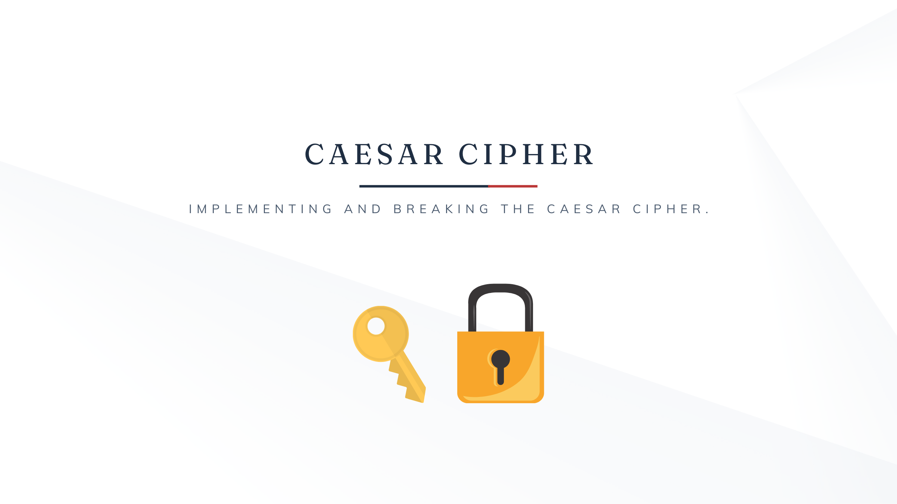
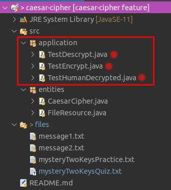
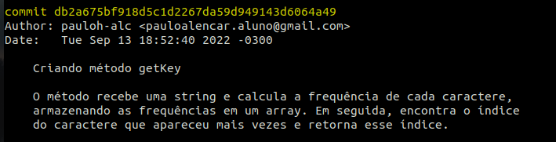
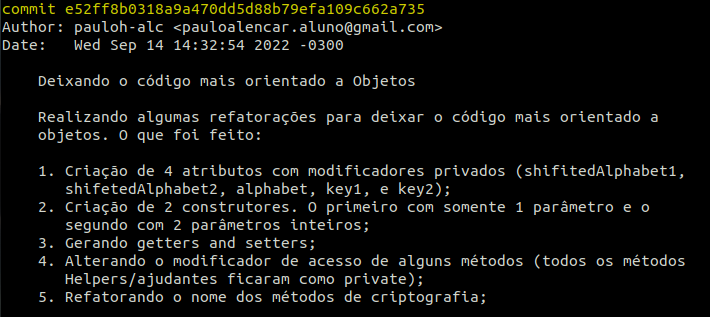
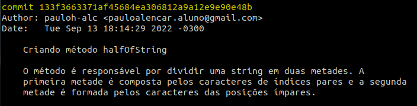
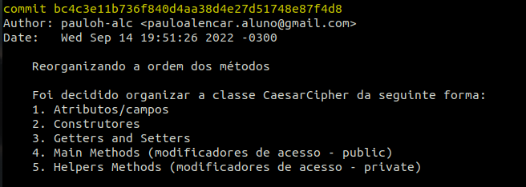
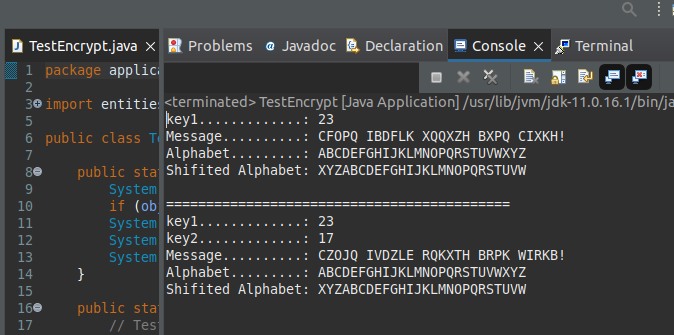

# Caesar Cipher

Cryptography: keeping Information Secret. Implementing and breaking the Caesar Cipher, with 1 or 2 keys.



## What is the Caesar Cipher? ️

In cryptography, a Caesar Cipher is one of the simplest and most widely known encryption techniques. It is a type of substitution cipher in which each letter in the plaintext is replaced by a letter some fixed number of positions down the alphabet.

For example, with a three-position swap, 'A' would be replaced by 'D', 'B' would become 'E', and so on. The method is named after Julius Caesar, who used it to communicate with his generals.

1) Alphabet
2) Shifted Alphabet

1. ABCDEFGHIJKLMNOPQRSTUVWXYZ
2. DEFGHIJKLMNOPQRSTUVWXYZABC

## Example

```sh
Plaintext:  THE QUICK BROWN FOX JUMPS OVER THE LAZY DOG
Ciphertext: QEB NRFZH YOLTK CLU GRJMP LSBO QEB IXWV ALD
```
_font:_ [link-en](https://en.wikipedia.org/wiki/Caesar_cipher)

## Installation

1. Clone this repository:
```sh
git clone https://github.com/pauloh-alc/caesar-cipher.git
```

2. Run the code in some IDE, running the test classes present in the application package



Observation: files directory has some files for testing.

## Version Control System

- Git

I tried to do the commits of this project in a well organized way. With that, apply some tips for a better commit message.

Follow the model: [commit-style](https://commit.style/)

- Some screenshots of commits 






## Code working



## License

[MIT](https://github.com/pauloh-alc/caesar-cipher/blob/main/LICENSE)
